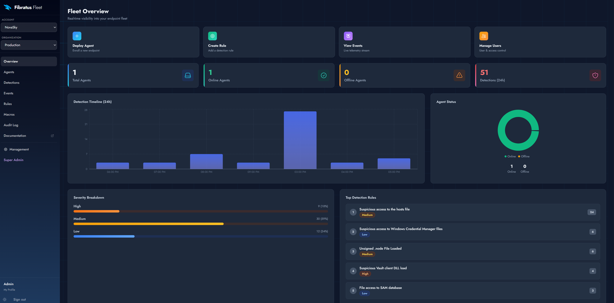
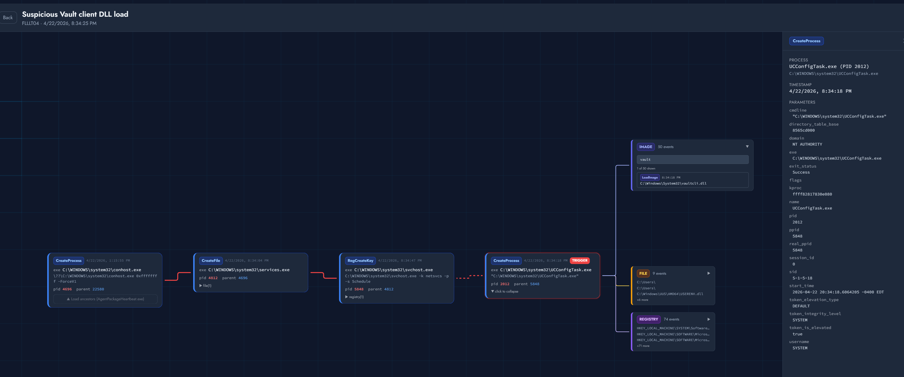
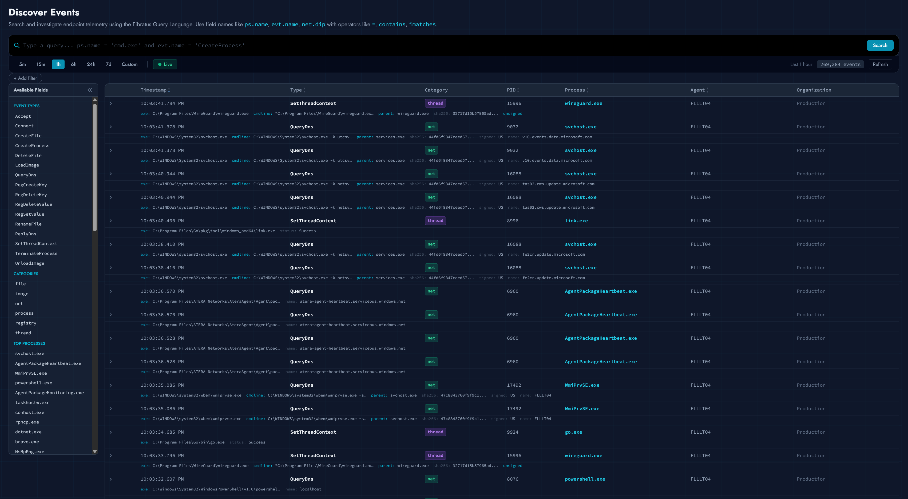
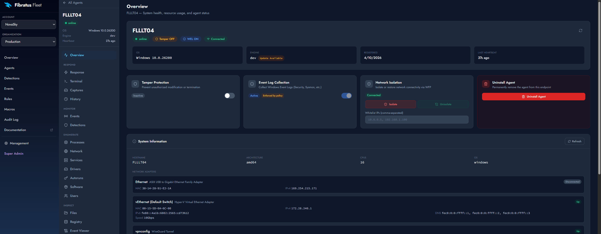
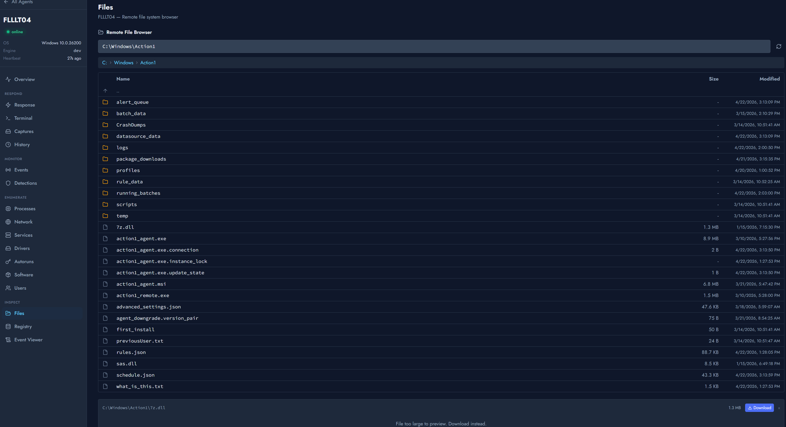
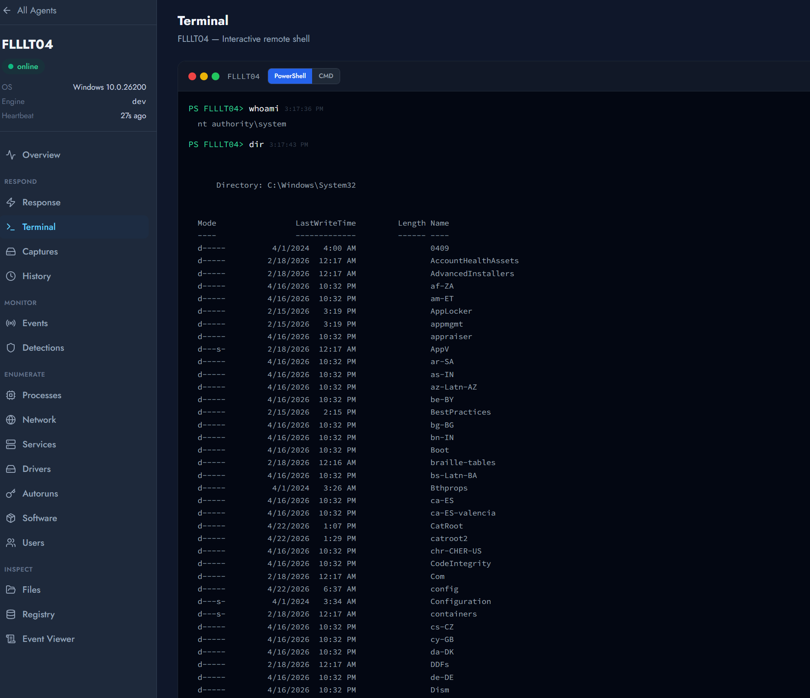
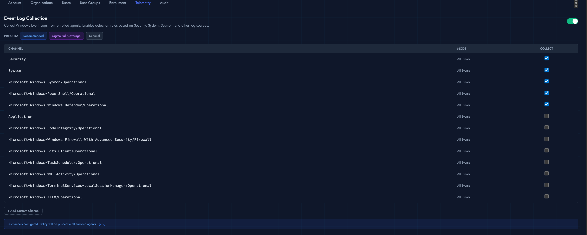
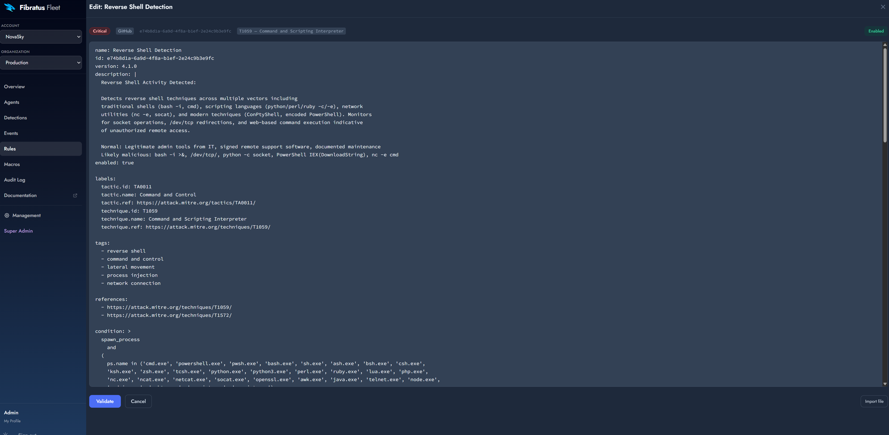
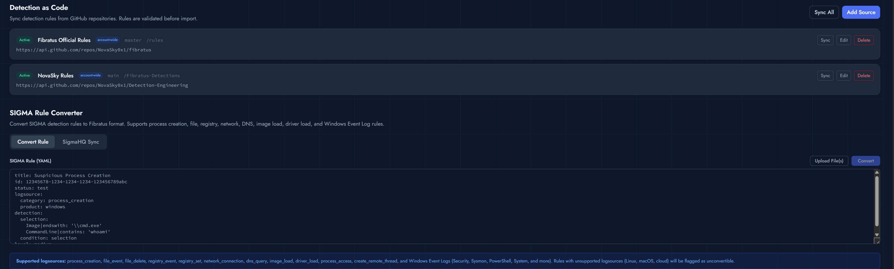

<p align="center">
  
</p>

<h1 align="center">Fibratus Fleet</h1>

<p align="center">
  <strong>Open-source EDR for Windows — centralized rule, agent, and detection management on top of <a href="https://github.com/rabbitstack/fibratus">Fibratus</a>.</strong>
  <br>
  <br>
  Multi-tenant. Self-hosted. Built on PostgreSQL + ClickHouse.
</p>

<p align="center">
  
  
  
  
</p>

---

> **Built on top of [Fibratus](https://github.com/rabbitstack/fibratus) by Nedim Šabić Šabić** — the kernel-level Windows EDR engine that powers everything in this fleet. Without that work this project would not exist. Fibratus Fleet adds a centralized server, multi-tenant management, dashboard, active response, telemetry pipeline, and detection-as-code workflows to a single host's worth of Fibratus into a managed fleet.

## Table of Contents

- [What is Fibratus Fleet?](#what-is-fibratus-fleet)
- [Screenshots](#screenshots)
- [Architecture](#architecture)
- [Capabilities](#capabilities)
  - [Telemetry pipeline](#telemetry-pipeline-clickhouse)
  - [Detection engine](#detection-engine)
  - [Active response](#active-response)
  - [Process tree investigations](#process-tree-investigations)
  - [Live captures and event log](#live-captures-and-event-log)
  - [Detection-as-code + SIGMA](#detection-as-code--sigma)
  - [Multi-tenancy](#multi-tenancy)
  - [Tamper protection](#tamper-protection)
- [Quick start](#quick-start)
- [Agent enrollment](#agent-enrollment)
- [ClickHouse profiles (local ↔ Cloud)](#clickhouse-profiles-local--cloud)
- [Documentation](#documentation)
- [Credits](#credits)
- [License](#license)

---

## What is Fibratus Fleet?

Fibratus is a Windows-native EDR engine that consumes ETW kernel events, evaluates them against YAML detection rules mapped to MITRE ATT&CK, scans process memory with YARA, and supports forensic capture/replay. It is fantastic. It runs **per host**.

**Fibratus Fleet** wraps that engine in a centralized server so an operator can:

- Manage hundreds of Windows endpoints from one dashboard
- Author and ship detection rules to every agent without touching the host
- Stream kernel telemetry into a columnar store (ClickHouse) for cross-fleet investigation
- Run **active response** actions on demand (isolate hosts, kill processes, capture files, run shells, dump kernel captures, scan with YARA)
- Walk a complete process tree — across hosts, across time — to chase a detection back to its origin
- Map YAML rules to MITRE ATT&CK and ship them as code from a Git repository
- Convert SIGMA rules to Fibratus QL automatically
- Operate in a multi-tenant model: accounts → organisations → users with RBAC

Everything is open-source, self-hosted, and works with either a local ClickHouse or a managed [ClickHouse Cloud](https://clickhouse.com/cloud) service.

## Screenshots

### Overview dashboard


### Process tree investigation


### Live SIEM-style event view


### Agent detail with active response


### Remote file browser


### Remote shell


### Windows Event Log collection


### Detector creation (custom rules)


### Detection-as-code (Git-synced rules)


## Architecture

```
┌─────────────────────────────────────────────────────────────────┐
│                       Windows Endpoints                         │
│        (Fibratus agent — Windows Service, ETW kernel)           │
└───────────────────────────────┬─────────────────────────────────┘
                                │ mTLS / gRPC
                                ▼
┌─────────────────────────────────────────────────────────────────┐
│                       Fleet Server (Linux)                      │
│  Go binary · enroll · heartbeat · command dispatch · telemetry  │
└─────────┬─────────────────────────────────────────┬─────────────┘
          │                                         │
          ▼                                         ▼
┌──────────────────────┐                ┌────────────────────────┐
│      PostgreSQL      │                │       ClickHouse       │
│ accounts · orgs ·    │                │ Per-org telemetry_*    │
│ agents · rules ·     │                │ tables · TTL retention │
│ detections · enroll  │                │ · local OR Cloud       │
│ tokens · system_*    │                │                        │
└──────────────────────┘                └────────────────────────┘
                                                    ▲
                                  hot-swap profile  │
                          ┌─────────────────────────┘
                          │
                          ▼
                ┌──────────────────────┐
                │   ClickHouse Cloud   │
                │      (managed)       │
                └──────────────────────┘
```

| Plane | Component | Notes |
|-------|-----------|-------|
| **Agent** | `fibratus.exe` (Windows Service) | Built on the upstream Fibratus binary. Adds enrollment, mTLS gRPC stream, command executor, tamper protection, on-demand YARA. Runs as `LocalSystem` |
| **Server** | `fleet-server` (Go, Linux) | Single static binary. Serves dashboard, REST API, gRPC, install one-liner, MSI redirect |
| **Reverse proxy** | Nginx | TLS termination via Let's Encrypt + reverse proxy to fleet-server |
| **State store** | PostgreSQL | Accounts, organisations, users, agents, rules, detections, enrollment tokens, encrypted secrets, settings, ClickHouse profiles |
| **Telemetry store** | ClickHouse | Per-org table (`telemetry_<slug>_<id8>`) with TTL-driven retention. Profile-aware: switch between self-hosted and ClickHouse Cloud at runtime |
| **Dashboard** | React 18 + TypeScript + Vite + Tailwind | Single-page app served as static files by Nginx |

## Capabilities

### Telemetry pipeline (ClickHouse)

- Per-org tables with columnar compression, TTL-driven retention, configurable per account from the dashboard
- **Hot-swap between local self-hosted ClickHouse and managed [ClickHouse Cloud](https://clickhouse.com/cloud)** — Connection profiles persist in PostgreSQL, switching drains the buffered telemetry stream and reopens against the new connection without restarting the server
- ClickHouse Cloud setup is fully UI-driven: paste your Console API key, list organisations and services, rotate the service password from inside the dashboard, bind in one click — passwords land encrypted in PostgreSQL via AES-256-GCM
- A buffered ingest layer batches kernel events (50 000 events / 2 second flush) so a chatty host doesn't N+1 the database
- See [`docs/fleet/clickhouse-profiles.md`](docs/fleet/clickhouse-profiles.md) for the full local-vs-Cloud model

### Detection engine

- The full upstream Fibratus YAML rule format, server-managed
- Sequence rules (multi-event matching with temporal constraints)
- Macro support — official Fibratus macros (`spawn_process`, `modify_registry_value`, etc.) ship with every new account
- Per-rule YARA scan selector — pin rules to specific YARA rules
- 126 baseline detection rules mapped to MITRE ATT&CK
- Per-org rule overrides + per-rule disable/enable
- Detection deduplication and per-org noisy-rule reports

### Active response

Every command listed below runs server-on-demand against an enrolled agent, results stream back over gRPC, and audit log captures who issued what.

| Category | Commands |
|----------|----------|
| **Containment** | `isolate` / `unisolate` (Windows Filtering Platform host firewall, with optional always-allow whitelist), `kill_process`, `set_tamper_protection` |
| **Forensic acquisition** | `start_capture` / `stop_capture` (live Windows kernel `.kcap`), `get_file` (with CMMC/HIPAA-compliant file-extension allowlist), `list_directory`, `export_evtx` |
| **Live triage** | `run_command` (PowerShell), `collect_info` (host facts), `get_processes`, `get_network`, `get_services`, `get_drivers`, `get_autoruns`, `get_software`, `get_users`, `get_registry`, `query_eventlog`, `list_eventlog_channels` |
| **Detection** | `yara_scan` (server-managed rule set, no client-side rule files), `set_eventlog_policy` (channel allowlist) |
| **Lifecycle** | `update_agent`, `uninstall`, `logoff_user` |

### Process tree investigations

A dedicated process-tree page walks the parent/child graph of every process the agent has observed across time, joins it with the detection that fired, and surfaces the kernel events emitted by every node. Click any process to pivot — by hash, by command line, by parent, by image path — across the entire fleet.

### Live captures and event log

- **Live kernel captures**: trigger a `start_capture`, wait, `stop_capture`, download the `.kcap` file. Replays in any local Fibratus install for offline investigation.
- **Windows Event Log**: per-channel subscription policies pushed from the dashboard; filtered events stream into the fleet's SIEM-style live view.

### Detection-as-code + SIGMA

- **Git sync**: point an account at a GitHub repo + branch + path; the server polls and imports rules with macro-aware validation. Rule modifications outside the sync (via the dashboard) are tracked separately so an operator can override an upstream rule without losing it on the next sync.
- **SIGMA conversion**: paste or import [SIGMA](https://github.com/SigmaHQ/sigma) rules; server converts to Fibratus QL using a server-side mapping, validates against macros, and stores them. SigmaHQ project repo can be wired directly as a Git source.

### Multi-tenancy

```
Accounts (root admins manage cross-account)
  └── Organisations
        ├── Users (with RBAC: page:* and resource:* permissions)
        ├── Agents
        ├── Rules (org-scoped) + global rules (account-scoped)
        ├── Macros
        └── Telemetry tables (one ClickHouse table per org)
```

- Org-scoped data isolation everywhere
- User groups + permission system replaces hard-coded roles
- Optional **2FA enforcement per account** (TOTP)
- Optional **open self-service signup** (toggle from Super Admin → Settings) — useful for public previews; defaults to admin approval

### Tamper protection

- Service start type protected with SYSTEM-only ACLs on the SCM registry key
- Enrollment data + agent cert/key stored DPAPI-encrypted in `HKLM\SOFTWARE\Fibratus\Enrollment` with the same lockdown
- Re-enrollment self-heals the locked tree via take-ownership flow — no manual `Remove-Item` needed
- Encrypted-secret store on the server side: AES-256-GCM under `FLEET_SECRET_KEY` (env var or auto-generated `master.key`), holds ClickHouse passwords + ClickHouse Cloud API credentials

## Quick start

### Server (Ubuntu/Debian)

```bash
git clone https://github.com/NovaSky0x1/fibratus.git
cd fibratus
git checkout feat/fleet-server
sudo bash deploy/install-fleet-server.sh
```

The interactive installer:
1. Installs PostgreSQL, ClickHouse, Nginx, Certbot, Go, Node.js
2. Asks for your domain and TLS mode (Let's Encrypt / self-signed / custom)
3. Generates a master key for the encrypted secret store
4. Builds the Go server binary and React dashboard
5. Bootstraps your first root admin account
6. Writes credentials to `/etc/fibratus/install-credentials.txt` (delete after stashing securely)

Once it finishes, browse to your domain and log in.

### Agent (Windows)

From the dashboard: **Management → Enrollment → Create Token**. Copy the install one-liner. On the target Windows host (elevated PowerShell):

```powershell
irm https://your-fleet-server/install/<token> | iex
```

The install script:
1. Downloads the latest MSI from the GitHub release
2. Installs as a Windows Service running as `LocalSystem`
3. Generates an RSA key pair, gets a cert from the per-org CA, stores everything DPAPI-encrypted
4. Polls until the service reaches `Running` (or dumps full diagnostics on failure)

The host shows up in the dashboard's Agents page within ~30 seconds.

## Agent enrollment

Enrollment is mTLS-based:

1. Server generates a per-organisation Certificate Authority on first enrollment
2. Agent generates an RSA-2048 key pair locally
3. Agent sends a CSR with its hostname; server signs with the org CA
4. Agent stores `cert + key + ca` in DPAPI-encrypted registry values, locked to SYSTEM
5. All future communication (heartbeat, command poll, telemetry, alert push) flows over mTLS gRPC

Enrollment tokens are revocable, expire on a configurable schedule, and have per-token agent caps. Re-enrolling a host reuses the same hostname; the previous agent row is decommissioned automatically.

## ClickHouse profiles (local ↔ Cloud)

The fleet stores **two persistent connection profiles** — `local` and `cloud` — and lets you flip between them with one click. The active profile drives the live telemetry pipeline; switching drains the in-memory buffer, opens a fresh connection to the new profile, swaps atomically, and closes the old connection. **No service restart**.

Setup the cloud profile end-to-end via **Database → ClickHouse → Cloud Setup**: paste a [ClickHouse Cloud Console API key](https://console.clickhouse.cloud/), pick organisation, pick or create service, hit "Rotate & bind" (rotates the service password via the API and stores it encrypted) — done.

Full guide: [`docs/fleet/clickhouse-profiles.md`](docs/fleet/clickhouse-profiles.md)

## Documentation

The full Fibratus Fleet docs site (Docsify) lives in [`docs/`](docs/). Highlights:

- [Fleet overview](docs/fleet/overview.md)
- [Deployment](docs/fleet/deployment.md)
- [Configuration](docs/fleet/configuration.md)
- [Agent enrollment](docs/fleet/enrollment.md)
- [Active response commands](docs/fleet/active-response.md)
- [Telemetry pipeline](docs/fleet/telemetry.md)
- [ClickHouse profiles + Cloud](docs/fleet/clickhouse-profiles.md)
- [Detection rules](docs/fleet/rules.md)
- [YARA rule management](docs/fleet/yara-rules.md)
- [SIGMA integration](docs/fleet/sigma.md)
- [Tamper protection](docs/fleet/tamper-protection.md)
- [Security & RBAC](docs/fleet/security.md)
- [API reference](docs/fleet/api.md)
- [Troubleshooting](docs/fleet/troubleshooting.md)

The upstream Fibratus engine documentation (filters, events, rule format, captures, YARA) lives unchanged at [fibratus.io](https://www.fibratus.io).

## Credits

This project is built on the shoulders of two outstanding open-source projects:

- **[Fibratus](https://github.com/rabbitstack/fibratus)** by **Nedim Šabić Šabić** — the kernel-level Windows EDR engine, ETW collection pipeline, rule engine, YARA scanner, and capture format. Fibratus Fleet adds nothing to the agent that is not already excellent in the upstream project; everything you see here builds on that foundation.
- **[SIGMA](https://github.com/SigmaHQ/sigma)** by **Florian Roth** and the SigmaHQ community — the generic detection rule format that lets Fibratus Fleet import and convert community-curated detections.

The original [`README-UPSTREAM.md`](README-UPSTREAM.md) (the upstream Fibratus README) is preserved unchanged in this repository.

## License

Apache 2.0 — same as upstream Fibratus. See [`LICENSE`](LICENSE).
